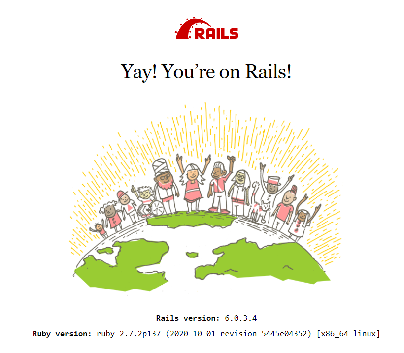

## 1. Environment

- Node.js 21.3.0

## 2. Reference

- [『パーフェクトRuby on Rails【増補改訂版】』](https://gihyo.jp/book/2014/978-4-7741-6516-5)

## 3. Docker

### 3-1. Boot Docker Process

```bash
$ docker-compose build
$ docker-compose up -d
```

### 3-2. Rails

#### 3-2-1. Setup database

```bash
$ docker-compose exec app bin/setup
```

#### 3-3-2. Access `localhost:4000`



#### 3-3-2. Reflect initial data

Login via 'GitHubでログイン', and a user data will be created in `user` table.  
Then, run `docker-compose exec app bin/rails db:seed` to reflect initial data.

## 4. `config/credentials.yml.enc`

Define a GitHub `client_id` and `client_secret`.

```yaml
# aws:
#   access_key_id: 123
#   secret_access_key: 345
secret_key_base: xxxxxxxxxxxxxxxxxxxxxxxx
github:
  client_id: [your_client_id]
  client_secret: [your_client_secret]
```
